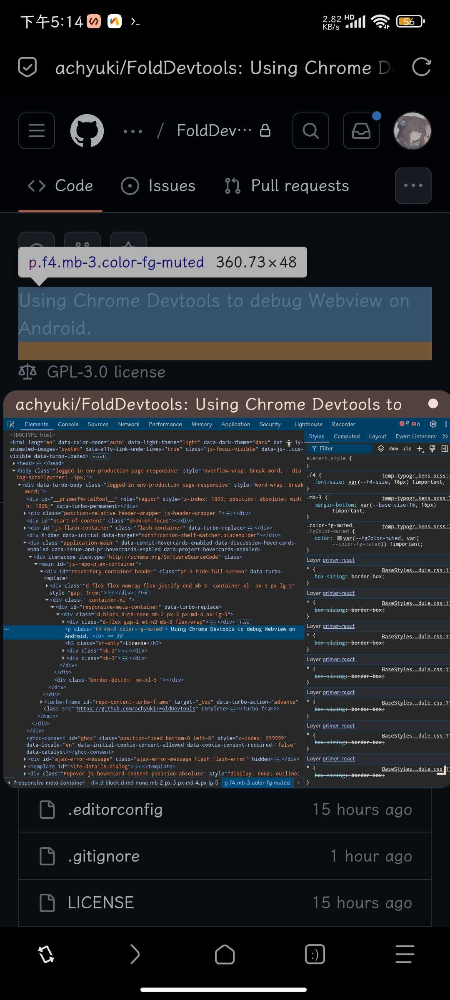

<div align="center">


# FoldDevtools

</div>

> Using chrome devtools to debug WebView on Android.

|  | [Download from releases](https://github.com/achyuki/FoldDevtools/releases) |
-|-

# Features

* Debug local WebView with root access
* Debug remote browser via address
* Force-enable WebView debugging with XPosed
* Use devtools through floating window
* Support [Stetho](https://github.com/facebook/stetho)/[StethoX](https://github.com/5ec1cff/StethoX)

# Rootless

> [!warning]
> For non-rooted Android devices, you need to manually forward the WebView debug socket to a local port using adb, and then connect to `127.0.0.1:9222` using FoldDevtools remote mode.

Termux:
```
# Get the debug localsocket name of WebView
adb shell cat /proc/net/unix | grep devtools_remote
# 0000000000000000: 00000002 00000000 00010000 0001 01 xxxxxxx @webview_devtools_remote_<pid>

# Perform port forwarding
adb forward tcp:9222 localabstract:webview_devtools_remote_<pid>
```

## License

Licensed under the [GPL-3.0](https://www.gnu.org/licenses/gpl-3.0.html) License.
